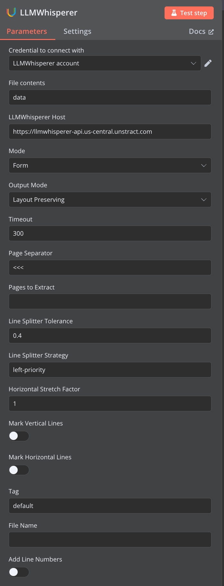

# n8n-nodes-unstract
<div align="center">


[](https://community.n8n.io/)


</div>
This is an n8n community node package that provides integrations with Unstract services, including LLMWhisperer and the Unstract API. These nodes enable seamless document processing and text extraction workflows within your n8n automations.

## What is Unstract?

[Unstract](https://unstract.com) is a platform that helps extract structured data from unstructured documents using AI. It provides powerful APIs for document processing, including:

- **LLMWhisperer**: Convert documents to layout-preserved plain text
- **Unstract API**: Extract structured data from documents using custom workflows

## Features

This package includes following main nodes:

### 🔤 LLMWhisperer Node
- Convert documents (PDF, images, etc.) to layout-preserved plain text
- Maintain document structure and formatting
- Support for various document formats
- Configurable processing modes

### 🤖 Unstract Node
- Process documents using Unstract's AI-powered extraction
- Extract structured data from unstructured documents
- Support for custom API deployments
- Seamless integration with Unstract workflows

### 📤 Unstract HITL Push Node
- Push documents to Human-in-the-Loop (HITL) processing queues
- Configure timeout, metrics, metadata, and queue targeting
- Support for various document types and queue configurations
- Error handling for upload and processing issues

### 📥 Unstract HITL Fetch Node
- Retrieve approved results from HITL processing queues
- Poll for completed processing with configurable intervals
- Optional queue name parameter for targeted fetching
- Proper error handling for "No approved items available" responses

## Installation

### Community Nodes (Recommended)

1. Go to **Settings > Community Nodes** in your n8n instance
2. Select **Install a community node**
3. Enter the npm package name: `n8n-nodes-unstract`
4. Click **Install**

### Manual Installation

You can install this node package in your n8n instance using npm:

```bash
npm install n8n-nodes-unstract
```

For Docker installations, add the package to your n8n container:

```bash
# Replace <your-path-to-n8n-custom-nodes> with the path to n8n
N8N_CUSTOM_EXTENSIONS="<your-path-to-n8n-custom-nodes>" npx n8n start
```

## Configuration

### Prerequisites

Before using these nodes, you'll need:

1. **API Credentials**: Get your API keys from:
   - [LLMWhisperer API - Follow the doc](https://docs.unstract.com/llmwhisperer/llm_whisperer/getting_started/llm_whisperer_registering/)
   - [Unstract Platform - Follow the doc](https://docs.unstract.com/unstract/unstract_platform/api_deployment/unstract_api_deployment_intro/)

2. **Node.js**: Version 20 or above is required

### Setting up Credentials

1. **LLMWhisperer API Credentials**:
   - Go to your n8n credentials settings
   - Create new credentials of type "LLMWhisperer API"
   - Enter your LLMWhisperer API key

2. **Unstract API Credentials**:
   - Go to your n8n credentials settings
   - Create new credentials of type "Unstract API"
   - Enter your Unstract API key and endpoint details

3. **Unstract HITL Credentials**:
   - Go to your n8n credentials settings
   - Create new credentials of type "Unstract HITL"
   - Enter your HITL API key for Human-in-the-Loop processing

## Usage Examples

### LLMWhisperer Node

Use the LLMWhisperer node to convert documents to text while preserving layout:

1. Add the LLMWhisperer node to your workflow
2. Configure your API credentials
3. Set the input file (binary data)
4. Choose processing mode and options
5. Execute to get layout-preserved text output

### Unstract Node

Use the Unstract node to extract structured data:

1. Add the Unstract node to your workflow
2. Configure your API credentials and deployment
3. Set the input document (binary data)
4. Specify your API deployment name
5. Execute to get structured data output

### Unstract HITL Push Node

Use the HITL Push node to send documents for human review:

1. Add the Unstract HITL Push node to your workflow
2. Configure your HITL API credentials
3. Set the input document (binary data)
4. Configure queue name, timeout, and metadata options
5. Execute to push document to HITL processing queue

### Unstract HITL Fetch Node

Use the HITL Fetch node to retrieve approved results:

1. Add the Unstract HITL Fetch node to your workflow
2. Configure your HITL API credentials
3. Optionally specify a queue name to target specific queues
4. Configure polling interval and retry settings
5. Execute to fetch approved results from HITL queue

## Screenshots

### Node Integration Examples

Visual guides for integrating Unstract nodes in your n8n workflows:

#### LLMWhisperer Node Configuration


#### Unstract Node Configuration  


#### HITL Push Node Configuration


#### HITL Fetch Node Configuration


These screenshots help developers understand the visual setup and configuration of each node type for seamless integration into n8n workflows.

## API Documentation

For detailed API documentation and advanced configuration options:

- [LLMWhisperer Documentation](https://docs.unstract.com/llm_whisperer/)
- [Unstract Platform Documentation](https://docs.unstract.com/unstract/)

## Development

### Prerequisites

- Node.js 20 or above
- npm or yarn

### Setup

```bash
# Clone the repository
git clone https://github.com/Zipstack/n8n-nodes.git
cd n8n-nodes

# Install dependencies
npm install

# Build the project
npm run build

# Run linting
npm run lint
```

### Running n8n with Custom Nodes

For development and testing:

```bash
# Set the custom extensions path and start n8n
N8N_CUSTOM_EXTENSIONS="/path/to/n8n-nodes" npx n8n start
```

## Support

- **Documentation**: [docs.unstract.com](https://docs.unstract.com)
- **Issues**: [GitHub Issues](https://github.com/Zipstack/n8n-nodes/issues)
- **Community**: [Join our community discussions](https://join.slack.com/t/unstract/shared_invite/zt-372jed537-bYz99iZnfXnhqyjbU8lPLg)
- **Email**: support@unstract.com

## License

This project is licensed under the MIT License - see the package.json file for details.

## Contributing

We welcome contributions! Please feel free to submit issues, feature requests, or pull requests.

---

**Made with ❤️ by the Unstract team**
